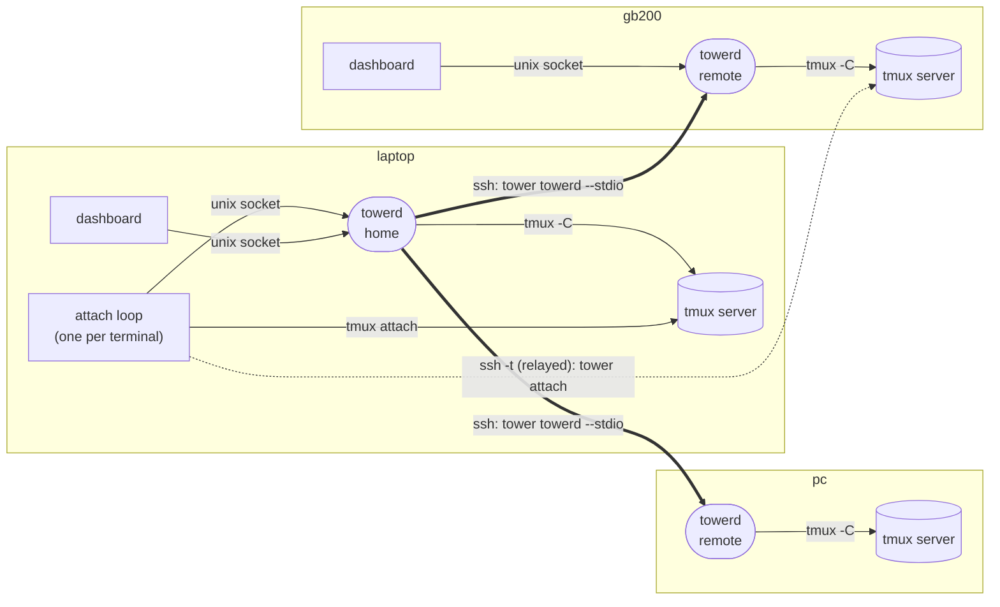

# tower: overview

tower makes the tmux servers on several machines feel like one local tmux
server: one place to see every session on every host, and one key to move
between them, without ever nesting tmux.

This page is the product design: what tower does, its parts and its scope.
[protocol.md](protocol.md) is how the parts talk and every edge case they
handle; [scenarios.md](scenarios.md) is the acceptance suite that pins the
behaviour down; `docs/design/` holds one design note per package.

## Goals

1. **v0.0.1: sessions.** A dashboard that lists every host's sessions,
   windows and zoxide dirs and moves you between them, local or remote, as
   if they were on one tmux server. It replaces a plain fzf session picker
   (`prefix o`).
2. **Later: agents and notifications.** Track coding agents in any pane on
   any host, and surface what needs attention (an agent waiting, a job
   finished, a host going down) from wherever you are.

The top requirement throughout is that tower feels native: as fast as plain
tmux wherever the network allows, and the same habits.

## Glossary

| Term | Meaning |
| --- | --- |
| **tower** | The product: the dashboard, the attach loop and the CLI, all one binary. |
| **towerd** | The tower daemon; one per user and tmux server on every machine. |
| **home** | The role of the towerd on the machine you work from. |
| **remote** | The role of the towerd on every other machine. |
| **attach loop** | The `tower` process that owns a terminal and attaches it to one target at a time. |
| **attach shim** | `tower attach`: registers with the towerd on the target machine, then execs `tmux attach`. |
| **bridge** | `tower towerd --stdio`, run by the home's ssh: joins ssh's stdin and stdout to the towerd there. |
| **dashboard** | The UI, shown in a tmux popup (or in the attach loop's terminal before the first attach). |
| **host** | A machine in tower's host list, plus the implicit local server. |
| **target** | host + session + window (+ pane) to attach to. |
| **hand-off** | Moving an attach loop's terminal from one host's tmux to another's. |
| **current / previous** | Where an attach loop is attached, and where it was before. |
| **standby** | An ssh session a loop keeps open to a remote host, waiting to become its next attach. |
| **relay** | The loop copying the terminal to and from a remote attach's ssh session on a pty of its own. |
| **view** | The home's merged picture of every host, sent to every remote. |
| **state** | One towerd's picture of its own tmux, sent to each home. |

## Principles

- **One tmux layer at a time.** Moving to another machine swaps which tmux
  server your terminal is attached to; tmux never runs inside tmux.
- **The home owns the decisions.** The home towerd is the only one that
  reaches every host (some hosts resolve only from the laptop) and the only
  one whose attach loops control your terminals. Remote towerds answer for
  their own machine and know nothing of each other.
- **Remotes need little.** A remote needs tmux 3.2+ and the tower binary,
  which the home installs over ssh when it is missing or outdated. No sshd
  on the laptop, no agent forwarding, no reverse tunnels.
- **tmux draws the frame.** The dashboard runs in a `display-popup`, which
  owns the border and title.
- **Nothing tower needs lives in tmux.** tmux only hosts one hidden session,
  `_tower`, as the anchor for towerd's control client.

## Hosts

- **The list is tower's own**, not every `Host` in `~/.ssh/config`: that
  file holds tunnels and jump hosts that run no tmux. ssh config supplies
  candidates to add and the connection details.
- `~/.config/tower/hosts.toml` is the list, hand-editable. Per host: `name`
  (label), `ssh` (any target ssh accepts), `enabled`, and the optional
  `tmux` (extra tmux arguments, e.g. `-L work`), `tower` (a binary the user
  manages there, which turns off install on connect), `standby` and
  `obscure_keystrokes`. The local server is implicit.

  ```toml
  [[host]]
  name = "gb200"
  ssh  = "gb200"

  [[host]]
  name = "pp"
  ssh  = "pp"
  enabled = false
  ```

- `~/.local/state/tower/` holds what tower learns: each host's OS, tmux
  version and last known sessions, so an offline host still shows its
  cached list after a restart.
- **Adding:** `tower host add <target> [--name …]`, or `a` in the
  dashboard's hosts column. Checks run in order and show in the host's row:
  ssh with `BatchMode=yes`, tmux 3.2+, `uname -s`, the tower binary
  (installed on connect). A failed check keeps the host with the reason and
  the fix.
- **Editing:** remove (`x`, `tower host rm`), rename the label (`r`), turn
  off or on (`space`, `tower host off|on`). Edits to `hosts.toml` are picked
  up when the dashboard next opens.
- **Order:** most recent attach first (the newest `session_last_attached`
  among the host's sessions, so attaches made outside tower count), in three
  bands: reachable, then down, then turned off.

## Architecture

Every machine runs the same daemon, **towerd**, one per user and tmux
server, the way each machine runs its own tmux server. What differs is the
role:

- **home**: the towerd on the machine you work from. It connects to the
  other machines' towerds, merges their states into one view, and owns the
  attach loops of your terminals.
- **remote**: the towerd on every other machine. It answers for its own
  machine and serves dashboards opened there.

One towerd can be remote for one home and a home itself. A towerd started
only by a home's ssh stays remote-only until an attach loop starts on its
own machine, so a `hosts.toml` shared between machines never makes every
machine dial every other.



- **towerd** starts on the first `tower` call (one per user and tmux
  server, a lock decides), outlives terminals, and exits when idle. It
  watches its own tmux through a control-mode client attached to `_tower`,
  so it has a live view without polling, and runs kill, rename and new
  directly. It serves local clients over a unix socket.
- **home ↔ remote** is one ssh session per host running the bridge: a
  versioned stream of JSON lines, no port forwarding. ssh runs with
  `BatchMode`, a control master per host and keepalives, without touching
  `~/.ssh/config`. A remote streams its state; the home merges and sends
  the view back, so a dashboard on any machine reads everything from its
  own towerd.

## One command

`tower` is one command whose role depends on where it runs:

- **Outside tmux** it is the attach loop, the terminal's command (Ghostty
  runs `tower`). It reattaches to the last target; the picker appears only
  when there is none or after an error.
- **Inside tmux** it is the dashboard. `prefix o` (or towerd's own `M-o`)
  runs it in a popup for the client that pressed the key; typed at a shell
  prompt, it opens that popup for its own client. It never nests tmux.

`tower dash` is `tower` that starts at the picker. Inside tmux it is the
same popup. Outside tmux it is the attach loop with the picker open before
the first attach, so a second terminal window can choose its own target
instead of joining the last one; `Esc` there attaches to the last target,
or exits when there is none.

`tower last` is tmux's `switch-client -l` across hosts.

## Feeling like local tmux

tower behaves the way plain tmux does, host boundaries aside:

- **`prefix d`** ends tower and gives the terminal back. The session keeps
  running and the next `tower` reattaches to it.
- **A session's last pane closes:** if tmux can move the client on that
  server (`detach-on-destroy no-detached`), tmux does and tower follows.
  Otherwise tower goes to the loop's previous session if nobody is on it,
  else the most recent session nobody is on, on any host, and says so in
  the status line. With no such session anywhere, tower exits.
- **A switch to another host** keeps the old frame on screen until the new
  client has drawn (synchronized output), as a local `switch-client`
  repaints. The target on a LAN, from the switch being stored to the new
  client: about 11ms into the laptop and 17ms into a remote through a
  standby session.
- **Keys:** towerd binds `M-o` (the dashboard) and `prefix L` (`tower
  last`) on its own server when they are free, so a remote without your
  dotfiles gets them too; your own bindings win.

Known gaps:

- The hidden `_tower` session shows in `tmux ls`.
- A remote's own tmux config decides its prefix, theme and other keys.
- A session created from the dashboard on a remote lacks your login
  environment until you attach.

## Attach loop

The attach loop attaches the terminal to one target at a time and registers
with the home towerd under a loop id. A local target is `tower attach` on
the terminal itself; a remote target is the same shim over `ssh -t`, on a
pty the loop owns and relays.

The dashboard decides what `⏎` does:

- **Same server:** `tmux switch-client`; the attach goes on.
- **Another server:** a switch request (target, nonce) to the dashboard's
  towerd, relayed to the home, which wakes the loop: the loop holds the
  frame, ends the old client, and attaches to the new target.

Kill, rename and new session on another host go the same way: a request to
the dashboard's towerd, relayed through the home, run by the target host's
towerd.

## Binaries on other hosts: install on connect

The home checks each host's tower version over the existing ssh master. If
it is missing or differs from the home's, the home copies the right build
to `~/.local/share/tower/<version>/tower` there and swaps a `current`
symlink. A running towerd keeps its old file until the next connect's
bridge replaces it (towerd's upgrade path). Builds for other platforms come
from the GitHub release assets that match the home's version, downloaded
once into `~/.cache/tower/dist/<version>/`; remote hosts never need
GitHub. For development builds, `mise run dist` fills that cache. `tower =
…` in `hosts.toml` pins a binary the user manages instead.

## v0.0.1 scope

- The column dashboard on live data from the local towerd, and remote hosts
  through home ↔ remote streams.
- Parity with the fzf session picker it replaces: sessions, zoxide dirs,
  the git-root filter, rename, a named new session, grouped duplicate, and
  kill.
- The attach loop, hand-off, standby sessions and the relay.
- Install on connect.
- Requirements: tmux 3.2+ on every host; fzf where the picker runs.

## After v0.0.1

- **Agents.** Agent hooks set a per-pane tmux option (`@tower-agent
  waiting|working|done`); the home subscribes on every host, so the
  dashboard marks panes, windows, sessions and hosts, and jumps to "the next
  agent waiting for me".
- **Notifications.** The home already sees every host's events, so it can
  raise one stream of alerts (an agent waiting, a long command finishing, a
  bell, a host going down) as desktop notifications and a dashboard badge.
- **Status line.** A compact summary (agents waiting, hosts down) in every
  host's tmux status bar, fed by the same push.
- Password and 2FA hosts (one interactive login per control master, from
  the attach loop's terminal).

## Prior art

- **herdr**: a local client drawing remote servers' state over an ssh stdio
  bridge, with one sidebar across machines. tower borrows its
  always-connected links, its reconnect behaviour, and "only the selected
  machine streams pane contents". tmux cannot copy its thin-client model: a
  tmux client passes its terminal to the server as a file descriptor, which
  cannot cross ssh; control mode is the closest equivalent.
