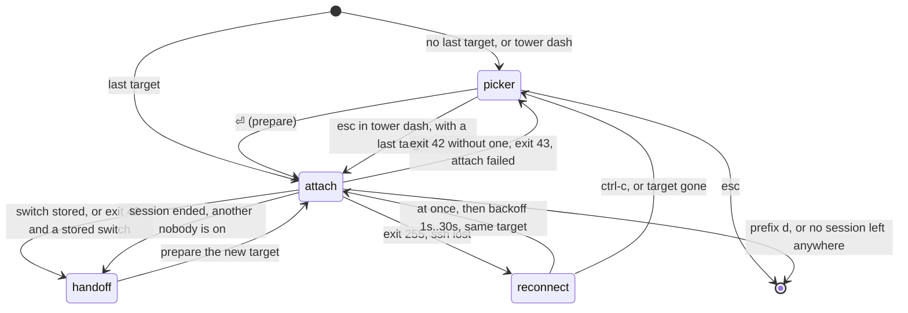

# tower protocol

How tower's parts talk, and every edge case they handle. The product design
is in [overview.md](overview.md); the scenarios that prove each rule are in
[scenarios.md](scenarios.md) and are cited by id (S00…, LV01…).

## Parts

| Part | Command | Runs on | Talks to |
| --- | --- | --- | --- |
| **towerd** | `tower towerd` | every machine, one per user and tmux server | its own tmux through a control client; local clients over a unix socket; homes or remotes over ssh streams |
| **bridge** | `tower towerd --stdio` | a remote, run by a home's ssh | joins ssh's stdin and stdout to the towerd there, starting it if needed |
| **attach loop** | `tower` outside tmux | the machine you work from, one per terminal | its home towerd; runs the attach shim on the terminal (local) or over `ssh -t` on a pty it relays (remote) |
| **attach shim** | `tower attach` | the target's machine, for one attach | registers its pid with the towerd there, then execs `tmux attach`; as a standby it first waits for the attach's arguments |
| **dashboard** | `tower` inside tmux | whichever machine the terminal is attached to | only that machine's towerd |

Each towerd plays one or both roles:

- **home**: links to every host in `hosts.toml`, merges their states with
  its own into one view, sends the view back to each, owns its loops'
  current, previous and pending switch, and routes requests.
- **remote**: answers for its own machine and keeps each connected home's
  view and clients apart.

A towerd started by a bridge is **remote-only** until an attach loop starts
on its own machine, so a shared `hosts.toml` never turns every machine into
a home (V05). The same towerd can be remote for one home and a home itself
(S01).

## Identities

| Identity | Made of | Unique within | Used for |
| --- | --- | --- | --- |
| machine key | sha256(machine id + uid), 12 hex | every machine and user | per-machine run and state directories, so a shared (NFS) home directory works (V04) |
| tmux tag | `default`, `L-<name>`, or `S-<hash of the socket path>` | a machine | one towerd per tmux server: lock, socket and state are per tag (S05) |
| towerd id | 8 random hex, made once per machine key and tag | every towerd | a host's identity on the wire: two aliases of one host are one towerd (S03); a home's id tags its clients on remotes |
| loop id | 8 random hex, per loop process | a home | the loop's state, clients and pending switch |
| attach generation | a counter per loop, +1 on every attach | a loop | tells this attach's switch from an earlier one |
| client pid | the pid of `tower attach`, which execs into the tmux client | a machine (plus `client_created` against pid reuse) | ties a dashboard's key press to the loop, generation and home that started that client |
| server instance | `#{pid}:#{start_time}` of the tmux server | a tmux server | session, window and pane ids are valid only within one instance |
| host name | the label in `hosts.toml` | a home | what users see; another home may name the same machine differently, so requests carry the towerd id |

The machine id is `/etc/machine-id` (Linux) or `IOPlatformUUID` (macOS).
Reading it on macOS runs `ioreg` (about 10ms), so processes that start
helpers on the same machine pass the key down in `TOWER_MKEY` (12 lowercase
hex, else ignored). towerd drops `TOWER_MKEY` from its own environment so it
never reaches a tmux server towerd starts, its shells, or ssh. The attach
shim gets its machine's key from the home (`--mkey`: the key that machine's
towerd gave in its hello) and keeps it only if a towerd answers under it
with that key.

Two aliases that reach the same towerd are one host: the first to connect
is linked, the other is shown `dup: same towerd as <name>` and its stream
closed.

## Where state lives

| Path | Holds |
| --- | --- |
| `~/.config/tower/hosts.toml` | the host list |
| `~/.local/state/tower/towerd/<machine>-<tag>/` | `id`, `towerd.log`, `towerd.pid`, `ctl.pid` (the control client), `clients.json` (registered clients, survives restarts), `hosts.json` (home: what it learned per host, with the last known sessions), `last.json` (the loops' last target), `keys.json` (bindings towerd replaced) |
| `<run>/<tag>.sock`, `<run>/<tag>.lock` | the towerd socket and its lock |
| `<run>/cm/%C` | ssh control sockets |

`<run>` is `$XDG_RUNTIME_DIR/tower` when set; otherwise the first of
`<state>/run-<machine>`, `$TMPDIR/tower-<uid>/<hash>` and
`/tmp/tower-<uid>/<hash>` that is short enough for a 104-byte unix socket
path, including the 17 bytes ssh appends to a control path while creating
it (S16). `TOWER_HOME` moves config and state under one directory (tests,
demos): `$TOWER_HOME/config` and `$TOWER_HOME/state`.

## towerd lifecycle

- **Ensure.** Whatever needs a towerd (the loop, the dashboard, the shim,
  the bridge) asks it for `status`. If nobody answers it starts `tower
  towerd` detached (its own session), asks again every 10ms, and starts
  another every 100ms. The lock decides between concurrent starters; the
  losers exit (V01: 8 concurrent first calls, one towerd).
- **Wedged.** A towerd that holds its lock and accepts on its socket but
  does not answer (stopped, or stuck) would block every other from
  starting. Ensure asks for 1s more, then SIGKILLs it by `towerd.pid`
  (after checking the lock is held and the process is a towerd) and starts
  another, which picks up the clients file and reaps the control client as
  after a crash (LH06).
- **The lock is the open file**, held for the life of the process: a
  garbage-collected file closes and silently drops the flock (V03).
- **Stale socket.** Only the lock holder binds the socket, and it removes a
  file left by a towerd that died (V01).
- **tmux and fzf binaries.** A version manager's shim (mise, asdf) is a
  process start of its own on every call: 60–80ms for `tmux` through mise's
  shim, against 3ms for the binary. towerd resolves both once as it starts:
  each match on `PATH` in turn, asking a shim's manager which binary it
  runs (`mise which tmux`); a shim that cannot say is passed over for the
  next match. Every tower process takes the paths from towerd's `status`
  answer, which ensure already asks for; helpers that fzf runs get them in
  `TOWER_TMUX_BIN` and `TOWER_FZF_BIN`, which towerd drops from its own
  environment. A path is used only if it is absolute and executable (LC07).
- **Upgrade.** Every call carries the caller's version. A newer binary asks
  an older towerd to exit and starts itself; an older binary uses a newer
  towerd and never downgrades it. A restart loses nothing: loops re-send
  their state in their heartbeat and remotes keep their clients file (V02).
  A remote is upgraded by its next ssh: the new bridge replaces the older
  towerd, which restores its clients from disk (V03).
- **Exit.** On `tower stop`, SIGTERM, its socket or state directory
  disappearing, or after `TOWER_IDLE` (10 minutes) with no loop, no
  connected home, no live registered client and no call (S02, E02).
- **The keeper.** If towerd dies without closing its control client
  (SIGKILL, a crash), `_tower` stays, often with its `tmux -C` client: tmux
  never finishes a control client whose reader is gone while output is
  queued, that client no longer shows in `list-clients`, and either keeps
  the server alive after the last session. So `_tower`'s one pane runs
  `tower _keep <towerd pid> <state dir>`: every second it checks that
  towerd is alive; once it is gone it kills the control client in `ctl.pid`
  (unless its parent is the towerd now in `towerd.pid`) and exits, which
  ends `_tower` (`remain-on-exit off`). A towerd started meanwhile is
  watched instead, and also kills a leftover client itself (V07, S02).
- **Shutdown order.** Detach the control client **by name**, then kill
  `_tower`, all before closing the socket; the links and streams go after.
  A bare `detach-client` from a control client whose session is gone falls
  through to the most recently active client, the user's terminal (V03).

## The home ↔ remote stream

`ssh -T <opts> <host> -- '<tower> towerd --stdio --tmux <args>'`, one JSON
message per line. Names and paths only ever travel inside the stream, never
on an ssh command line.

**ssh options**, the same on every call (the stream, an attach, a probe,
`-O exit`): `BatchMode=yes`, `ConnectTimeout=5`, `ServerAliveInterval=5`,
`ServerAliveCountMax=3`, and a control master per host (`ControlMaster=auto`,
`ControlPersist=10m`, `ControlPath=<run>/cm/%C`). With OpenSSH 9.5 or later
(asked once per ssh binary with `ssh -V`) also `ObscureKeystrokeTiming=no`:
ssh otherwise sends an interactive session's keys on a 20ms timer. The
setting belongs to the master, so it goes on every call;
`obscure_keystrokes = true` on a host keeps ssh's default.

**Failures are classified** from ssh's exit and stderr: host key changed or
unknown, a locked key or password needed (`load the key with ssh-add, or set
one up with ssh-copy-id`), cannot resolve, refused, timed out, `tower is not
installed on <host>` (exit 127). A Tailscale SSH check (a banner naming
"Tailscale SSH" and a check, after which the connection is held until a
browser login) is read from stderr as it arrives: the ssh is ended at once
and the host is down with "Tailscale SSH wants a check: run `ssh <host>`
once" (S15).

**Control sockets.** Before a connect, each socket in `<run>/cm` is dialled
and removed only if the dial is refused (nobody listens); a socket that is
merely slow to accept is another host's healthy master and stays (S16).

### Messages

| Message | Direction | Content |
| --- | --- | --- |
| `hello` | both, first | protocol range, towerd id, label, the name the home uses for the remote (`as`), version, home id; the remote's answer adds the chosen protocol, machine key, OS, tmux version, or an error |
| `state` | remote → home | the remote's sessions and windows (ages against its own clock), its tmux instance, and the clients of **this home's** loops with where each is now |
| `view` | home → remote | the merged view of every host, with this home's loops (current, previous), numbered |
| `exec` | home → remote | a request to run there (kill, rename, new, capture, has-session) |
| `relay` | remote → home | a request from a dashboard on the remote (switch, or an action elsewhere) |
| `ack` | answer to `exec` and `relay` | matched by request id |
| `ping` / `pong` | both | keepalive; `pong` carries the sender's clock |

- **Versioning.** Each side sends `[min, max]`; the remote picks the highest
  version in common or answers an error naming both ranges, and the home
  marks the host `failed` with "install the same tower on both sides".
  Unknown message types are ignored and logged once, so a newer peer can
  add messages (S18).
- **Hello after the first look.** A towerd the bridge just started answers
  the hello only once it has read its tmux (at most until it is 2s old), so
  the host never shows up with no sessions while its first state is on the
  way (LC01).
- **Never write before reading.** Each side's first message is queued, not
  written synchronously: two large first messages written before either
  reader started deadlocked in full pipes (S20).
- **Sends never block.** Each stream has its own writer goroutine and
  queue. `exec`, `relay`, `ack`, `ping` and `pong` keep their order; `state`
  and `view` keep only the newest not yet written, so a slow peer gets the
  latest snapshot, not every one. A snapshot sent ahead of an answer (read
  your writes, below) goes in order and replaces a waiting one of its type.
  A host that stops reading holds up only its own stream (LH02, LH04). More
  than 4096 queued messages drops the stream.
- **Pushes are paced, not debounced.** A change after a quiet spell goes out
  at once; a burst is paced by a token bucket: two at once, then one per
  100ms (a towerd's state) or 150ms (the home's view). An unchanged body is
  not sent. The watch re-reads tmux the same way, one re-read per 50ms in a
  burst, taking every notification one tmux command wrote before re-reading.
  Targets: a change on one remote in another remote's view in about one
  round trip (14ms on a LAN, 62ms at a 50ms RTT, 0.41s at 400ms; LV01); a
  burst of 40 switches and 40 new windows costs the home about 17 states
  (LV02). A line has no size limit (S20 streams 2 MB states and views).
- **One stream per home and name.** A remote keys streams by `home id | as`.
  A new stream from the same home under the same name replaces the old,
  half-open one; there are never two (S13). Different homes, or aliases of
  one home, stay separate until the home marks the duplicate and closes it
  (S02, S03).
- A lost home's last view is **kept on the remote**, marked "not connected"
  with its age, for an hour (V07).

### Liveness

- **Keepalive.** Each side pings as soon as the hello is done, then every
  1s (`TOWER_PING`), and gives up after 15s (home) or 35s (remote) of
  silence. Any byte read counts, so a large message crawling over a slow
  link is not silence.
- **Stalled.** A peer silent for longer than one ping interval plus three
  of its slow recent round trips, at least 1s of them (a slow round trip
  is the second slowest of the last 8; the hello's before the first pong) is marked `stalled`; any byte clears it.
  While a host is stalled dashboards show it and refuse `⏎` to it; a
  request or a hand-off to it fails at once, and a pending one is aborted;
  a refused hand-off leaves the loop where it was, with a note. An attach
  whose host stalls before the home sees its client is killed and the loop
  goes back to its previous session (LH03). A request aborted by a stall
  may still run if the host is heard again before its deadline.
- **Dead links.** The home gives up a host stalled for 3s plus four of its
  slow round trips (5–7s after it went silent). As the stall is marked, the
  home probes ssh with a fresh session on the host's master (`ssh -o
  ControlMaster=no … true`, given 2s plus two round trips). If ssh answers,
  only the stream is closed and reconnected; the master and the attaches on
  it are kept, and the new bridge replaces a wedged towerd (LH06: stalled
  after 2s, given up after 5s, up again after 8s, the attached client never
  cut). If it does not, giving up first makes the master exit (`ssh -O
  exit`), since a new stream would ride the dead master and hang; that ends
  the attaches on it too, and their loops reattach. A link silent since a
  network change, or for the whole keepalive (a sleep), is presumed
  half-open and reset without a probe. Either way the link reconnects at
  once, waiting for a master reset already under way. A slow but live link
  stays up: round trips up to 400ms, 200–800ms each way, for 30s (LC05).
  The remote never gives up early: it cannot reconnect, and the home will.
- **Network changes.** Every second the home compares its interfaces'
  addresses (link-local ones left out). After a change, a stalled host not
  heard since is given up at once, and so is one that stalls later without
  being heard; a down host retries at once (LC03, LC06). `tower netchange`
  simulates a change.
- **Wake.** A wall clock that jumps past the monotonic clock is a wake: the
  home closes every stream and makes every master exit at once, in
  parallel, so one wedged master holds up no other host (LH05).
- **Reconnect** with backoff from 1s to 2m with jitter, reset only after 30s
  up (S14). A link given up as dead reconnects without waiting out its
  backoff, and one that was up for the stable period is retried within
  200ms of dropping.

## Clocks and deadlines

No timestamp crosses machines as data:

- Session ages are computed on the machine that owns the session, against
  that tmux server's clock, and moved forward by the time since the message
  arrived.
- Request deadlines are absolute in the sender's clock. Each stream
  measures the peer's clock offset from ping/pong (the midpoint of the
  fastest of the last 8 pings; pings that spanned a stall are not counted),
  and each hop converts the deadline with it (S21: a remote an hour ahead
  still runs a request with a 1.5s deadline; S23: a frozen home that thaws
  after the deadline refuses the stale request).
- Each hop that passes a request on keeps back one slow recent round trip,
  at least 200ms, for the answer to get back in time (LD02).
- Hand-off freshness (30s) is judged by the home alone, on its own clock.

## Attach

The loop asks its home to **prepare** a target. The home:

1. waits for that host (8s), checks that the session (and window) exists in
   the server instance it was listed on, and refuses otherwise ("restarted
   since it was listed", "selection is gone");
2. increments the loop's generation, sets `prev = cur`, `cur = target`, and
   drops any pending switch for the loop;
3. returns the attach command: locally `tower attach --loop L --gen G
   --home H --inst I --mkey K '$3' '@7' --tmux …`, remotely the same behind
   `ssh -t <opts> <host> --`, plus, for a remote host, the go line a
   standby needs and the key a standby must have.

`tower attach` registers `{pid, loop, gen, home, inst}` with the towerd
there (starting it if needed), then execs:

```
tmux <args> attach-session -t '$3' \; \
  if-shell -F '#{!=:#{pid}:#{start_time},<inst>}' "detach-client -E 'exit 43'" \; \
  select-window -t '@7'
```

- **Attach by id.** A session killed in between fails visibly; `new -A`
  would create an empty session of the same name (S09).
- **The instance check comes right after the attach**, because tmux skips
  the rest of a command list after a failing command. A restarted server
  that reused `$3` detaches the client at once with exit 43 (S04).
- **The pid is the client.** The shim execs tmux, so the registered pid is
  the tmux client's. The towerd binds the registration to the client it
  then sees (name and `client_created`) and drops it when the client goes
  (S10). It sees the client at once (`%client-session-changed`); re-reads
  150ms, 600ms and 1.5s after the registration cover a missed one.
- **The window is selected by id**, so `base-index` never matters (S12).
- With `--mkey` and a current towerd answering under it, the registration
  is the shim's only call to towerd: its answer carries the towerd's key and
  tmux binary.

## Hand-off

The dashboard's `⏎` on a target on another server:

1. The popup's binding passes the pressing client:
   `run-shell -C 'display-popup -E "TOWER_CLIENT=#{client_pid}:#{client_created}:#{client_name} tower"'`.
   `display-popup` alone does not expand formats; `run-shell -C` does.
2. The dashboard asks its own towerd for a `switch` (target, nonce). That
   towerd looks up the client's registration (loop, generation, home) and
   relays the switch to that home, or handles it if it is the home.
3. The home checks that the loop exists and the generation is current, and
   stores the switch. A stale generation is refused here, before anything
   detaches (S06). **The switch is committed once stored**: it completes
   even if the dashboard dies (S07).
4. The home wakes the loop waiting on that attach (`wait-switch`). The loop
   holds the terminal's frame and confirms (`held`); the home answers `end`
   and acks the dashboard with `ended`.
5. The loop ends the old client itself (the eager hand-off) and reports
   exit 42 to `after`, whatever the client's own exit was:
   - a local client is detached through towerd's control client
     (`detach-client -t <client> -E 'exit 42'`);
   - a remote one's ssh gets SIGTERM: ssh closes the channel and the remote
     client gets a hang-up, an ordinary client end there; nothing the old
     host sends reaches the terminal after it. The loop writes that
     client's terminal restore (leave the alternate screen, mouse and paste
     modes off) itself, inside the hold, since the client's own never comes
     back (R02).

   The dashboard, told `ended`, only waits for its client to go, so its
   popup never closes first (tmux would redraw the pane under it, a synced
   frame that ends the hold early).
6. Otherwise (no loop waiting, `TOWER_EAGER=0`, or no `held` within 100ms)
   the ack has no `ended` and the dashboard holds the frame and runs
   `detach-client -t <client> -E 'exit 42'` itself. A `held` that comes
   later gets no `end`, so only one side ever ends the client; a dashboard
   whose detach finds its client already gone neither fails nor ends the
   hold.

Same-server targets are a plain `switch-client -c <client> -t $id`, and the
attach goes on (S11). The towerd there sees the client move and reports it
in its next `state`; the home updates that loop's current and previous.

Targets, in round trips r from `⏎` to the shim on the target over a warm
master (LC08), with standby sessions:

| From → to | r | at r = 150ms |
| --- | --- | --- |
| laptop → remote | 0.5r | 80ms |
| remote → laptop | 0.5r | 87ms |
| remote → remote | 1r | 156ms |

### After an attach ends

When the attach command exits, the loop calls `after` with its generation
and the exit code. The home takes the stored switch (read once):

| Exit | Condition | Action |
| --- | --- | --- |
| 42, or the loop ended the attach for a stored switch | a stored switch for this loop and generation, under 30s old | hand off to its target (prepare it) |
| 42 | anything else | picker, with the reason; never trust 42 alone (S06, S07) |
| 43 | – | picker: "restarted since it was listed" |
| 255 | remote | reconnect to the current target at once (prepare waits for the link), then with backoff 1s → 30s while it keeps failing; a failed prepare pauses at most 4s; more than 10s attached starts the backoff afresh; a new link to that host ends the pause; `ctrl-c` gives the picker (S13, LC01, LC02, LC04) |
| other | the session still exists (`prefix d`, the client closed) | exit, as tmux does; a pending switch is discarded and said so (S07, S10) |
| other | the session is gone, and tmux could not move the client on that server | the loop's previous session if nobody is on it, else the most recently used session nobody is on, on any reachable host, with a status-line note (S25) |
| other | the session is gone and no such session exists anywhere | exit (S25) |

Whether the session still exists is asked of its host directly
(`has-session` over the stream), so a detach returns the terminal in one
round trip. A host whose last session just ended may have no server left:
it is asked all the same, its towerd answers "no server", which means gone,
and a towerd whose control client closed with the server asks tmux itself
(S25).



### No flash between clients

A hand-off ends one tmux client and starts another; on its own the terminal
would show what lies under the alternate screen (the shell) in between.
tower holds the terminal's rendering with synchronized output (DEC mode
2026):

1. When the home stores a switch for the loop's attach, the loop writes
   `ESC[?2026h` and confirms `held`; only then does it end the old client.
   The loop owns the terminal and relays a remote client's output, so the
   hold reaches the terminal before the old client ends, on any host.
2. When the dashboard detaches (the fallback), it writes the hold to its
   client's tty (`#{client_tty}`) right before, where it can, re-holding
   after any frame tmux drew meanwhile: tmux ends each of its own synced
   frames with `ESC[?2026l`, which also ends tower's hold.
3. The loop holds again the instant the old client has gone.
4. The new client's first synced draw releases it. As a fallback the loop
   releases it 150ms after the home sees the new client (`watch` wakes when
   the home binds the client), or after 1.5s, and always before the picker
   or an exit. A fallback release carries the hold it belongs to and never
   ends a newer hold (S27).

The loop prints nothing between clients (S26). `TOWER_SYNC=0` turns the
hold off.

## Standby sessions

Each attach loop keeps one ssh session open ahead of time to every
connected remote host it is not attached to, so a switch there sends one
line instead of opening a session (a round trip and the remote shell's
start-up less).

1. **Offer.** The loop asks the home for `standby`: per host, the command
   `ssh -t <opts> <host> -- '<tower> attach --standby --mkey K --tmux …'`
   and its key (the link's generation, the towerd id and version there, and
   the command). The home offers one only for a host up for a second (a
   link that just came back carries its loops' reattaches first) and not
   stalled, and none for a host with `standby = false`. `TOWER_STANDBY=0`
   turns them off in the loop.
2. **Ready.** The loop runs the command on a pty of its own, with the
   terminal's modes (as they were before any client made it raw) and size.
   On the host the shim ensures its towerd, turns the pty's echo and line
   editing off, and writes a ready marker (an OSC sequence the loop strips).
3. **Go.** prepare's answer for a remote host carries the go line (the
   attach's arguments as JSON) and the key a standby must have. The loop
   uses the host's standby only if it is ready, has that key, and was made
   for this terminal: the same environment (tower's own variables left out)
   and modes (raw mode and kernel state bits such as `PENDIN` left out). It
   puts the terminal in raw mode, sizes the pty, and sends the line. The
   shim reads it a byte at a time (nothing typed after it is taken from
   tmux), restores the pty's modes, writes an answer marker, registers and
   execs tmux.
4. **Give up.** A standby that has not answered within 300ms plus two of
   the link's slow round trips is killed outright (a stopped process loses
   a SIGTERM), and the loop opens a new session under the same held frame
   (LS02). `TOWER_STANDBY_TIMEOUT` (ms) overrides the wait.
5. **Refill.** The host left gets a new standby.

The loop drops a standby whose key the home no longer offers, whose host is
gone, down or stalled, or whose host it is now attached to, and makes the
ones missing. It asks again on every change of the home's view, every 2s,
and when a standby is used or dies (LS03, LS04). A standby that dies before
it is ready backs its host off (1s, doubling to a minute); one not ready in
20s counts as dead; a shim nobody used exits after 12h. On loop exit the
loop ends them all; on a crash the kernel closes the loop's ptys, which
hangs up each ssh. A standby never registers and is no tmux client, so no
dashboard shows it (LS01).

Cost per loop and remote host: an ssh process and a pty here, a session and
a waiting tower process there. sshd's `MaxSessions` (10 per connection by
default) counts them, so with about nine terminals a host's new sessions
fail until standbys are turned off for it.

## The relay

Every remote attach is an `ssh -t` session on a pty the loop owns: a
standby's, or a new one running the attach command with the same modes,
size and environment a standby gets. That pty is ssh's terminal (it sends
its modes and size as the session opens, reads keys from it, writes its
prompts to it, gets SIGWINCH and, should the loop die, the hang-up). ssh's
stdout is a pipe: a pty passes 1 KB a read on macOS, which cost ssh and the
loop a wake-up per KB. While a session has the terminal, the loop puts the
terminal in raw mode and relays:

- the terminal's input to the pty, read only when there is some, so once
  the relay stops it takes nothing meant for the next client;
- the pipe's and the pty's output to the terminal;
- the window size, on every SIGWINCH.

The relay is byte-exact both ways (LS06) and adds microseconds to a
keystroke's echo (LS07: +7µs median). The loop's own writes (the frame's
hold and release) go in between whole escape sequences and UTF-8 characters
of the relayed output; a write that has waited 50ms on an unterminated
sequence goes anyway (LS06). The session's exit status is the attach's.
Exits 42, 43 and 255, a host stalling as it is switched to, `prefix d` and
the terminal's modes after it come out as with ssh given the terminal
(LS09). Throughput targets (LS08): a 200 MB `cat` at well over a gigabit
link's rate, the loop's memory flat, and a terminal that stops reading
stops the host's writes once the buffers between are full.

**Local attaches keep the terminal**: `tower attach` on the loop's machine
gives tmux the terminal itself. tmux writes each batch of output whole, and
a batch is split only while tmux floods the terminal, so the loop's two
writes during a local attach land where a break hardly shows. Relaying them
would put a pty hop on every byte.

`TOWER_RELAY=0` gives a remote attach's ssh the terminal itself and turns
standbys off, to tell a relay problem from another.

Job control is that of `ssh -t`: ctrl-z is a byte for the pane, and tmux's
`suspend-client` leaves a remote client suspended until SIGCONT (LS05).
ssh's own escape `~^Z` does nothing in a relayed session, since its ssh
leads a session of its own.

## Inside versus outside tmux

- Outside tmux, `tower` is the attach loop. Inside tmux (`$TMUX` set) it is
  the dashboard, never a nested attach (S11).
- A dashboard in a client no loop owns shows the home's view (its machine's
  home, or the latest home connected there) and can switch locally, but `⏎`
  to another host says it needs the attach loop (S11).
- tower is launched as the terminal's command, so the attach loop always
  owns the terminal.

## Keys

tmux key tables belong to the whole server, so towerd cannot give tower's
keys to tower's terminals only. When towerd attaches to its server it binds
two keys whose bindings do the native thing in a terminal tower does not
own:

| Key | Taken when | Bound to | In a terminal tower does not own |
| --- | --- | --- | --- |
| `M-o` (root table) | unbound | `run-shell -C 'display-popup -E "TOWER_CLIENT=… tower"'` | the dashboard: every host, local switches only |
| `prefix L` | unbound, or still tmux's default `switch-client -l` | `run-shell -C 'run-shell -b "TOWER_CLIENT=… tower last"'` | `tower last` runs tmux's own `switch-client -l` |

- **The user's config wins.** A key bound to anything else is left alone
  and logged.
- **What it replaced is recorded** (`keys.json`) and put back when towerd
  stops, for each key that still has tower's binding.
- **The binding carries towerd's `TOWER_*` environment** (a key binding
  starts from the tmux server's environment), and `TOWER_MKEY`.
- `tower last` falls back to `switch-client -l` when the terminal has no
  loop, the loop has no previous session, or towerd cannot be reached.
- `TOWER_BIND=0` turns the bindings off (V08).

**Alert hooks.** tmux sets a window's bell, activity and silence flags
without telling control clients. towerd adds global hooks `alert-bell`,
`alert-activity` and `alert-silence` at index 7193, each `display-message -c
<its control client> tower-alert`, and re-reads when that message arrives
(LV01). One the user set at that index is left alone; towerd removes only
its own on stop; `TOWER_ALERTS=0` turns them off.

## Live dashboards

- **towerd's `watch` op** blocks until what a dashboard there reads may have
  changed: its own rows, the view a home sent, the home's merged view, a
  home disconnecting, or a loop's new client seen by the home. It answers
  with a generation number at once when the caller's is stale, else after
  the change or 20s.
- An open dashboard follows the view without a key press, within about one
  round trip plus its redraw (LV04: 0.1s at 50ms), and keeps its cursor on
  the same row, not the same line.
- **Kill does not wait.** The row goes at once; while the kill is in flight
  the row stays hidden from every reload; the answer puts the outcome in
  the header, and a failed kill's row comes back with the error (LD01,
  LD03).
- `TOWER_LIVE=0` turns live updates off.

## Requests from dashboards

Kill, rename, new session and capture (previews) go to the dashboard's own
towerd with a request id and a deadline (5s):

- **On this machine** (by towerd id): run on the local control client.
- **Elsewhere**: to the client's home (relayed if this towerd is not it);
  the home runs it locally or sends `exec` over the target's stream.

Every hop converts the deadline to its own clock and refuses to start the
action after it, so a request the user was told had failed never runs later
(S23, LD02). The towerd that runs an action remembers its answer by request
id for 10 minutes and answers a repeat from it. A kill of something already
gone is `ok` with "already gone". Previews travel only on request, for the
selected window (V06); a preview shows the session's windows, which it has
from the view, before the capture arrives (LD01).

**Read your writes.** The rows a dashboard reads after an action's answer
show its result. Kill, rename and new re-read the session list before
answering (one re-read at a time, so an older one never lands after a
newer); a remote that ran it sends its state on the stream before the
`ack`, and a home answering a `relay` first sends the asking host the merged
view. Views are numbered, and a remote ignores one older than it holds
(LD01).

**No server.** A host with no tmux server is listed with no sessions; its
towerd polls every 2s and never starts one itself. `new` starts one with
`start-server ; source-file -` after the user's config, which may take
seconds with a plugin manager, so `new` on such a host waits up to 15s and
says "starting tmux on <host>…" (S17).

## Previous and current

Kept per loop, by its home:

- An attach anywhere new sets `prev = cur`; so does a move the loop's client
  makes on its server (reported in that server's `state`).
- A window change updates `cur` only.
- The pair travels in the home's view, so a remote dashboard's `-` and `.`
  need no one else.
- The loop keeps a copy and sends `{cur, prev, gen, host}` in its heartbeat
  (every 5s). A restarted home relearns them, replays every host's last
  client list, and hand-off keeps working (S24, V07).

## Environment

| Variable | Default | Meaning |
| --- | --- | --- |
| `TOWER_HOME` | – | config and state under one directory |
| `TOWER_TMUX` | – | tmux arguments selecting the server (`-L name`, `-S path`) |
| `TOWER_CLIENT` | – | `pid:created:name` of the client that pressed a key |
| `TOWER_MKEY`, `TOWER_TMUX_BIN`, `TOWER_FZF_BIN` | – | passed down to helpers; dropped by towerd |
| `TOWER_SSH` | `ssh` | the ssh binary |
| `TOWER_IDLE` | 10m | towerd's idle exit |
| `TOWER_PING` | 1s | the stream's ping interval |
| `TOWER_EAGER` | 1 | 0: the dashboard, not the loop, ends the old client |
| `TOWER_SYNC` | 1 | 0: no frame hold |
| `TOWER_STANDBY` | 1 | 0: no standby sessions |
| `TOWER_STANDBY_TIMEOUT` | – | ms a switch waits for a standby's answer |
| `TOWER_RELAY` | 1 | 0: ssh gets the terminal itself, no standbys |
| `TOWER_LIVE` | 1 | 0: dashboards do not follow changes |
| `TOWER_BIND` | 1 | 0: towerd binds no keys |
| `TOWER_ALERTS` | 1 | 0: no alert hooks |

Tests shorten the timings further (keepalive, backoff, TTL) through
variables listed in `test/scenario`.

## Requirements

- tmux 3.2+ on every host (`-f no-output`, `new-session -f`,
  `display-popup`, `list-sessions -f`).
- The tower binary on every host (installed on connect).
- fzf where the picker runs. tower passes `--no-popup`, because a `--tmux`
  in `FZF_DEFAULT_OPTS` makes fzf inside a popup exit at once.

## Not settled

- **`_tower` is visible** to `choose-tree`, `tmux ls` and session savers.
  tower's own listings filter it (`-f '#{!=:#{session_name},_tower}'`).
- **Which alias links is not deterministic:** the first to connect wins.
- **Views are sent whole.** Fine at 2 MB in tests; deltas would pay off
  above about 100 KB.
- **Real sleep and wake, and real clock skew,** are simulated.
